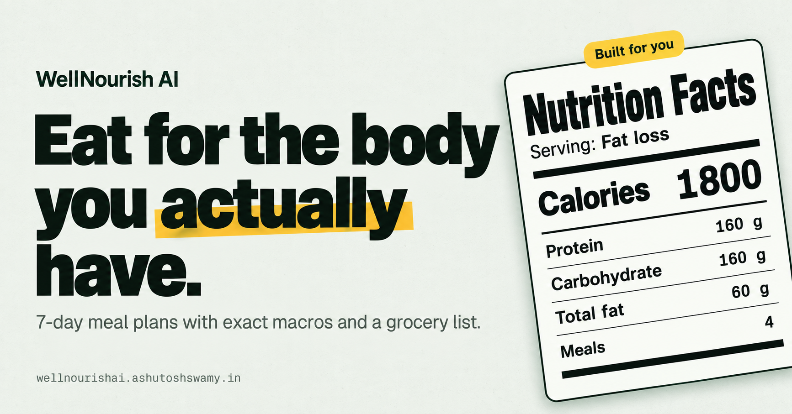

# WellNourish AI

Share your goals, allergies and routine. Get a 7-day meal plan with exact macros and a grocery list.

Live at [wellnourishai.ashutoshswamy.in](https://wellnourishai.ashutoshswamy.in)

## Features

- **Personalized 7-day meal plans** generated by Google Gemini (`gemini-3.5-flash-lite`) with structured JSON output, built from your age, sex, weight, height, goal weight, activity level, diet preference and allergies
- **Calorie and macro targets** per day and per meal (protein, carbohydrate, fat)
- **Grocery list** created automatically with each plan, with items you can check off as you shop
- **Plan history** sortable by date, with delete
- **Dashboard** showing your active plan and body metrics
- **Accounts** with email/password or Google sign-in (Firebase Auth), backed by server-verified session cookies
- **Light and dark themes** that follow your system, with a manual toggle
- **Rate limiting** of one new plan per user per hour

## Author

**Ashutosh Swamy**

- [GitHub](https://github.com/ashutoshswamy)
- [LinkedIn](https://linkedin.com/in/ashutoshswamy)
- [X](https://x.com/ashutoshswamy_)
- [Portfolio](https://ashutoshswamy.in)

## License

MIT. See [LICENSE](./LICENSE) for details.
